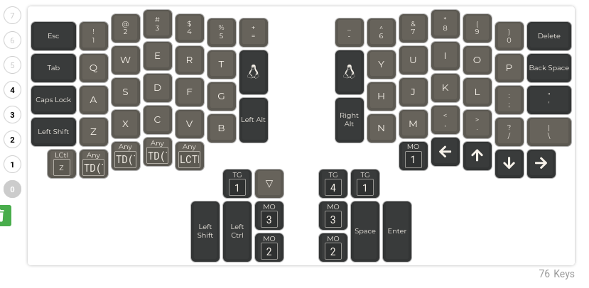
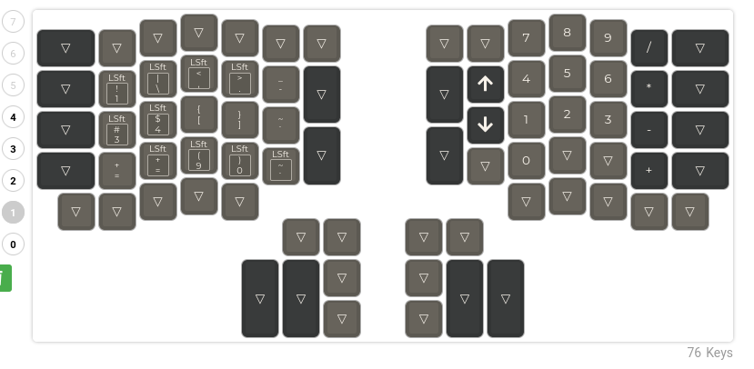
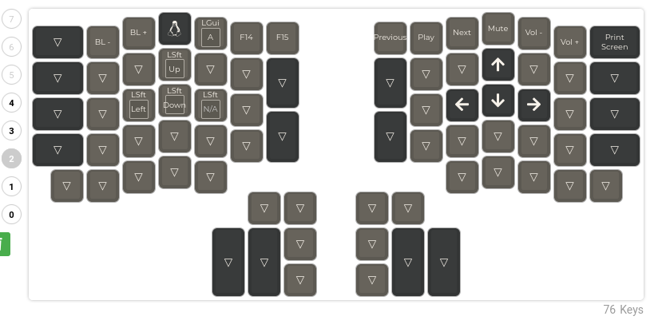
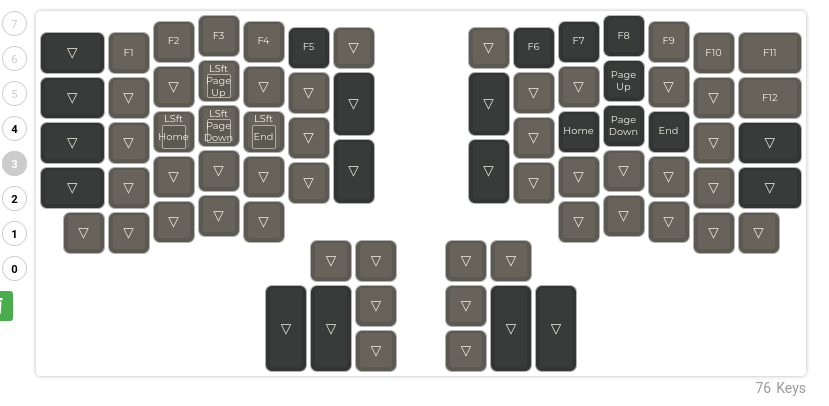
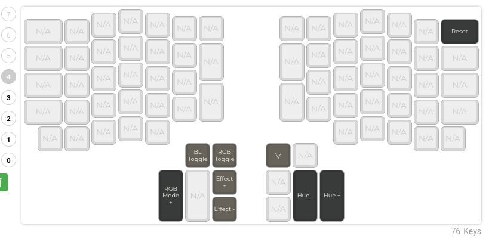

# hotdox76v2
Repo to store the layout + firmware for my hotdox76v2

*An Ergodox style keyboard with per key RGB.*

* Keyboard Maintainer: [Drashna Jael're](https://github.com/Drashna Jael're)
* Hardware Supported: Hotdox 76v2
* Hardware Availability: https://github.com/Oh-My-Mechanical-Keyboard 

Make example for this keyboard (after setting up your build environment):

    make hotdox76v2:default

Flashing example for this keyboard:

    make hotdox76v2:default:flash

See the [build environment setup](https://docs.qmk.fm/#/getting_started_build_tools) and the [make instructions](https://docs.qmk.fm/#/getting_started_make_guide) for more information. Brand new to QMK? Start with our [Complete Newbs Guide](https://docs.qmk.fm/#/newbs).

## Bootloader

Enter the bootloader in 3 ways:

* **Bootmagic reset**: Hold down the key at (0,0) in the matrix (usually the top left key or Escape) and plug in the keyboard
* **Physical reset button**: Briefly press the button on the back of the PCB - some may have pads you must short instead
* **Keycode in layout**: Press the key mapped to `RESET` if it is available


# OEM Alpaca Keyboard Hotdox76v2 Firmware

I reached out to Alpaca Keyboards regarding the stock firmware, and they were kind enough to provide me with the QMK code they used to compile ther original firmware. I've included it in this repo just in case someone else comes along with the same problem I had. 
The code itself is in`assets/alpaca_hotdox76v2.zip`, and the original firmware is in `assets/HotDox_V2_Firmware.zip`.


# My Notes

## Prerequisites

* I'm using Linux, specificlally Pop!_OS 22.04 (i.e. Ubuntu 22.04)
* QMK CLI is installed properly
* You have a basic understanding of C + how to use the command line. 

## Flashing with QMK

1. Starting wth a hotfox76v2 with stock firmware, clone the QMK firmware using Git
2. Open either the desktop or web application VIA
3. Make your desired layout adjustments
4. Copy the saved layout to `qmk_firmware/keyboards/hotdox76v2/keymaps/via`
5. Update the saved layout JSON with the following key + values:

```json
{
"keyboard": "hotdox76v2",
"keymap":"via",
"layout": "LAYOUT_ergodox"
}
```

6. Run `qmk via2json -kb hotdox76v2 -km via [via_layout_file].json -o keymap.json`.
    6.1 (Optional) Change the keymap.json file to some other name, then run `qmk json2c [some-other-name].json -o keymap.c`. If the keymap.json file still exists in the keymap directory it will be given priority over the `keymap.c` file. 
7. Assuming there are no errors, you will have a QMK compatible keymap. 
8. Navigate to the top-level parent directory `qmk_firmware/` and run `qmk flash -kb hotdox76v2 -km via -bl dfu-split-[right|left]`. Adjust the command based on which half of the keyboard is plugged into the computer.


## My Tweaks

* I removed the bit of code in the firmware that's essentially an offline-keylogger. It takes in the key code that the user is typing in and prints it out. Horrible if you type in sensitive information like, I dunno, *passwords*. I replaced it with a capslock indicator.

* Adjusted the layer titles to be more in-line with my uses. For example layer 2 was "office" but I mostly use it for coding and numpad functionality. 


## Misc Notes

* To adjust the layer titles, edit `hotdox76v2.c` and edit `render_layer()`. The `render_layer_helper_fun` takes in a set number of arguments including:

1. The start line
2. Data (In this case the string I want to print to the OLED)
3. Gap (Spacing in the display)
4. L (The length of the input)


# Layer Diagrams



Layer 0 is my primary layer for writing. Alphanumeric characters on both halves, with the arrow keys on the bottom right. Bottom left row has undo (i.e. ctrl+z), along with tapdance keys for cut, copy, paste. The tapdance keys in this case add a left shift to the command, which is helpful when copying things from a terminal. The left thumb cluster has shift and control, in addition to layer toggles. The right thumb cluster has space, enter, in addition to other layer toggles. 




Layer 1 is my coding/symbol layer on the left side, and the numpad on the right. The numpad is especially useful for punching in timed one-time passcodes. 



Layer 2 has my media keys on the top row, in addition to some basic navigation keys for highlighting and selecting text. The left hand side has left shift along with up, down, right, and left. This allows me to highlight text character by character. On the right side is basic arrow navigation like on layer 0.



Layer 3 is my "function" row, with keys f1-f12. In the same place as the shift + arrow keys on the left side, instead is shift and page up, page down, home, and end. This allows me to highlight text line by line or by visible page. 



Lastly, layer 4 is my "maintenance" layer where I can mess with the underlying RGB, and in the top right hand corner is my "reset" button. This is the `QK_BOOT` key which puts my keyboard into bootloader mode, allowing me to flash my firmware without having to press the reset button on the back of the keyboard. 

Note: Hitting `QK_BOOT` will only affect the keyboard half that's plugged into the computer -- not the half that physically has the key. Conceptually this makes sense -- the button on the back of the keyboard is a physical button, whereas the firmware is translating the key press into `QK_BOOT`.
